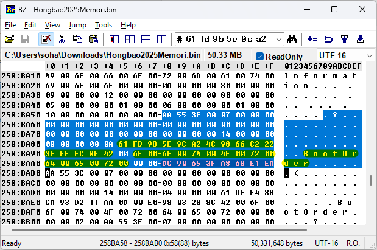

今年的红包字面上非常直白。打开页面，还是熟悉的配方，还是熟悉的味道。


嗯，看起来是有两个红包。第一个红包直接给了一个地址，第二个红包则是以一个“生气的玩家”的口吻，介绍了一个“从 Soha 电脑上抄出的内存数据”。那么接下来逐个介绍。

## “红”“包”

> 今年研究了一些新东西，访问 HTTPS://shebao25yisi.hb.lohu.info/ 就可以获得红包啦！
>
> **[T+03:00]** 某生气的玩家说：“我只是把 Soha 打晕了啊，并没有把第一个红包下掉。”Soha（揉揉头）：“确实，解析是全球任意可解的，红包也是点击就送的。”
>
> **[T+05:30]** It is really easy to get the first Red Packet once you resolved the address: request it & get it.

直接访问给出的链接，打不开。要获得这个红包，共有两个关键点：第一个关键就是获得解析，而“新东西”和大写的“HTTPS”就是提示。在 2023 年 11 月，定义 SVCB（Service Binding）这个 DNS 记录的 RFC 9460 正式获得了编号。而 HTTPS 作为互联网的一大基础协议，针对其特别定义的 SVCB 记录则被命名为 HTTPS 记录。

常规的 A/AAAA 记录没有解析，加上我在开始后 3 小时强调了“第一个红包依旧存在”且“解析是全球任意可解的”。因此，解析应该是通过其他手段获得。除了常规的 A/AAAA 记录之外，就是 SRV 记录和 SVCB/HTTPS 记录了。

查询 `SRV _https._tcp.shebao25yisi.hb.lohu.info` 是没有相关的结果的，但是 `HTTPS shebao25yisi.hb.lohu.info` 就不一样了：

```
$ dig +short HTTPS shebao25yisi.hb.lohu.info
1 . port=443 ipv6hint=2402:4e00:1801:ef0c:0:9e11:82c3:2531
```

不光明确了 IPv6 地址为何，还确定地告诉你就是 443 端口。

接下来就是第二个关键，怎么获得红包。原文是说“访问就可以获得”，第一个提示说“点击就送”。但是很多朋友没能理解它们的含义，不断在问“为什么端口没开”，有没有一种可能，没开就是预期的。而如果我们使用 `termshark` 或者 Wireshark 抓包，节目效果就非常充分了。


你就说这个 TCP RST 的 IP 分组（也叫做“IP 包”）是不是红色的吧！“Sequence Number (raw): 37085499”就是红包口令。如果你把“relative sequence number”的功能关掉的话，还能直接在上面的列表中看到 `Seq=37085499`，更直观。

什么？你说你用 tcpdump？那不变、又不是 1 的 seq 就更明显了吧：


这个红包很多人卡着都是因为没有意识到“服务器就是故意返回的 RST”，而都在研究“怎么找到能用的 HTTPS 服务”。如果有人扫过端口也会发现，除了 443 端口之外，其他端口连 RST 都不会给。（毕竟是[直接全 DROP](https://github.com/moesoha/red-packet-2025/blob/master/part2/deploy/etc/netns/hb/nftables.conf#L17) 了，只放行了我用 userspace 生成的 RST 报文。）

不过还有一些朋友是因为被自己家只放行 conntrack state 为 established/related 的防火墙坑了，根本没看到 RST 报文。

第二个提示基本上是把第一个提示的内容翻译了一遍，但是重点是让大家注意到我翻译“红包”一词的时候用的“Red Packet”一词，以联想到“IP packet”一词。在第二个提示出来之前，只有 4 个人领取，有了第二个提示以后，不少朋友都恍然大悟了。游戏快结束的时候还有人把这个词全大写以后发在了我频道的评论区中，虽然直接点名了答案，但红包余量还有一半，我也就睁一只眼闭一只眼了。

有些朋友在寻找解析的时候用了 ANY 类型，这是一个在 RFC 8482 中已经被判死刑的方式，很多 DNS 权威服务器和递归服务器（例如 Cloudflare）都已经不支持这种请求了。幸运的是，DNSPod（权威）和部分递归服务器目前还保留着这种支持，因此对于想不到、也没能查到 HTTPS 记录的朋友们来说，降低了一些获得成本。另外，之前研究过（可能过时），DNSPod 好像也是国内唯一支持 HTTPS 记录的服务商。

如果使用 Safari（或其内核）的浏览器，是会尝试查询 HTTPS 记录的，这些朋友会直接获得连接拒绝的提示，而其他朋友只会收到查询不到解析的提示。这是因为不论是服务模式的 ipv6hint/ipv4hint 还是别名模式，其他浏览器都不喜欢参考，只会参考 HTTPS 记录中有关 h2/h3 之类的提示。尽管草案很早就有了，标准化也已经一年多了，但 HTTPS 记录的落地还有很长的路要走。

根据数据统计，按照 /56 来计算，一共有 500+ IP 尝试访问 443 端口。该红包本来准备了 68 元，共发放 48 个，实际领走 35 个（共 47.86 元），最早于 T+03:27:48 领取。

本红包所使用的代码：[https://github.com/moesoha/red-packet-2025/blob/master/part2/src/main.rs](https://github.com/moesoha/red-packet-2025/blob/master/part2/src/main.rs)。

## 内存数据

> 我是某生气的玩家！
>
> Soha 的红包太难做了！每年都说简单，结果我都做不出来！这次我偷偷潜入 Soha 家，发现 Soha 正在准备第二个红包，一时气不过就给送了一棍子，看出来脑袋上是起了个大红包。接着，我把电脑内存用液氮冷冻起来后拔下来，在显微镜下观察内存颗粒，手工抄写数据出来。如果上面那个红包做不出来，不如看看这个内存数据吧：[Hongbao2025Memori.zip](https://github.com/moesoha/red-packet-2025/raw/refs/heads/master/part1/.artifact/Hongbao2025Memori.zip)

故事很有趣啊，但听起来要分析“内存数据”的话好像很复杂的样子。其实这个题目看似需要进行内存分析，实际上只是一个普通的二进制分析，只需要找到其中和红包有关的 EFI 程序和有关的 EFI 变量即可。

首先使用 `strings` 应该可以注意到有非常多的 `phd0`、`ptal` 等 edk2（常见的 UEFI 环境）用于标记内存分配池的头尾魔数，以及最重要的“hongbao”内容。

```
$ strings -tx Hongbao2025Memori.bin | grep hongbao
18ae7ea to check your hongbao code, input here and finish with an <ENTER>:
18ae832 incorrect hongbao code: %s
18ae84e KUNG HEI FAT CHOI! Go and get your hongbao with that code!
195a038 to check your hongbao code, input here and finish with an <ENTER>:
```

如果使用 `strings -el` 则可以按照 UTF-16 来进行提取，还可以看到下面的内容：

```
1933018 UEFI Interactive Shell v2.2
193315c EDK II
19332a0 UEFI v2.70 (EDK II, 0x00010000)
19333e4 Mapping table
1933528       FS0: Alias(s):HD0a0b:;BLK1:
193366c           PciRoot(0x0)/Pci(0x1,0x2)/USB(0x0,0x0)/HD(1,MBR,0xBE1AFDFA,0x3F,0xFBFC1)
19337b0      BLK0: Alias(s):
19338f4           PciRoot(0x0)/Pci(0x1,0x2)/USB(0x0,0x0)
1933a38 Press ESC in 1 seconds to skip startup.nsh or any other key to continue.
1933b7c Shell> FS0:
1933cc0 FS0:\> dir
1933e04 Directory of: FS0:\
1933f48 01/28/2025  17:17             146,816  Hongbao2025Checker.efi
193408c           1 File(s)     146,816 bytes
19341d0           0 Dir(s)
1934314 FS0:\> Hongbao2025Checker.efi
1934458  \ HAPPY NEW YEAR OF THE SNAKE (2025) /
1934824 to check your hongbao code, input here and finish with an <ENTER>:
```

这些实际上就是 EFI Shell 的缓冲区内容。可以看出，内存在被抓取之前，已经依次执行了 `FS0:` 切换盘符、`dir` 列目录、`Hongbao2025Checker.efi` 运行程序。而尾部没有 `FS0:\>` 的提示符，说明程序依旧在运行、等待用户输入，就像图里的这样：


从程序运行的内容可以看出，我们是要去分析 `Hongbao2025Checker.efi` 了，分析红包口令的校验代码，获得真正的口令。那么怎么得到这个 Hongbao2025Checker.efi 呢？他现在是正在运行的程序，那么应当已经被加载到了内存中。而我们重新看下最上面 `strings` 的结果，`0x18ae7ea` 是提示输入、`0x18ae832` 是输入正确、`0x18ae84e` 是输入错误。再配合 binwalk，我们可以发现 `0x189d000` 的位置有个 PE 头、以及紧随其后有 `/home/soha/red-packet-2025/part1` 开头的路径，那么这里应该就是我们要找的 EFI 程序了。


接着可以用 `dd` 之类的工具把它抠出来，至于抠多少就不赘述了。可以根据 dir 输出的大小去猜测、可以用 hexdump 看哪里开始是 `0xafafafaf` 的内存池填充、分析 PE 头的结构，而且就算抠多了也不会影响。接下来就是扔进你喜欢的工具对程序进行反编译了。只需要搜索“hongbao”就可以找到有关的代码，定位到以后就可以进行反编译了。


可以看到，在使用 `%8s` 读入一个 8 位字符串后，将其直接作为一个 64 位的整数，在后面进行了复杂的运算后和一个值（后称 hash）进行了比较。

而 hash 是怎么拿到的呢？是通过从 `0x18c09b0` 里的指针偏移 0x48 的位置取出了一个函数指针并调用得到的。那个指针的赋值发生在 `ModuleEntryPoint` 中，为该函数的第 2 个参数所指向位置偏移 0x58 的值。经过查阅 [UEFI 标准](https://uefi.org/specs/UEFI/2.10/04_EFI_System_Table.html#efi-image-entry-point)，可知那个指针实际上是 [EFI_SYSTEM_TABLE](https://uefi.org/specs/UEFI/2.10/04_EFI_System_Table.html#id6)+0x58 的 `RuntimeServices`。继续查询 [EFI_RUNTIME_SERVICES](https://uefi.org/specs/UEFI/2.10/04_EFI_System_Table.html#efi-runtime-services) 可知偏移 0x48 位置的函数指针是 [`GetVariable`](https://uefi.org/specs/UEFI/2.10/08_Services_Runtime_Services.html#getvariable)，用来获得系统中的 EFI 变量。他的前两个参数分别是变量名和 GUID，GUID 用来确定一个唯一的 vendor。

如果想了解这个函数的作用，但不想进行这么复杂的分析，也可以通过传入的参数进行猜测。直接可以看出来：第一个参数是一个字符串“BootOrder”，第二个参数是一串未知的二进制，第三个是常量 0，第四、第五个参数是接收什么返回的内容的。而第四个参数后面有进行 `cmp 8` 的比较、第五个参数则与一个复杂的算法进行了比较，那么第四个参数应该是 len、第五个参数是 hash，这个函数应该是一种获取数据的方式。


什么？你说你在第一个参数只看到了一个“B”？那你就是被你的工具坑了，IDA 就经常会把小端序 UTF-16 当作一个单字母的 ASCII 字符串，需要自己修正。

接着就是用这些线索去找 hash。虽然在内存中，`BootOrder` 有很多，但第二个参数 GUID 所对应的字节序列 `61 fd 9b 5e 9c a2 4c 98 66 c2 22 3f ff fc 8f` 只在内存中出现了 2 次。和 binwalk 结果进行对比，可以发现一次是在这个程序中出现，另一次就是在 `0x258a018` 位置处的 `UEFI PI Firmware Volume, volume size: 540672, header size: 0, revision: 0, Variable Storage` 中出现。



尾部的 8 字节就是我们想要的 hash，这就是一个 64 位小端序存储的整数。

`BootOrder` 的名字是我专门用来暗示这一步是获得“EFI 变量”的，如果有心的话，应该可以找到上述 UEFI 规范中定义的 GetVariable 函数，就算没找到，直接按照 GUID 序列搜内存也可以找到相应的数据进行解析。

有些朋友在拿到 EFI 以后自己起了一个 qemu 去启动，无一例外的都遇到了“Error: Not Found”输出，因为他们的 EFI 变量中没有我的红包口令 hash。顺便提一嘴，如果遇到了死循环式的疯狂输出，是因为没有在 EFI Shell 环境下手动执行，没有标准输入可以用所以爆了。

获得了 hash 以后，就是按照程序里的算法里面一样，遍历所有数字看什么数据可以匹配上，亦或者是按照其算法写出逆运算，然后就可以获得红包口令 78537340。

```c
#include <stdint.h>
#include <stdio.h>

uint8_t code[9] = {0};
#define CODE *(uint64_t *)code
#define HASH 0xeae168a83f6590dcULL
#define C1 0x165667b19e3779f9ULL
#define C2 0xc2b2ae3d27d4eb4fULL
#define C3 0x9e3779b185ebca87ULL
#define C4 0x3416ec30165668f6ULL
#define C5 0x7a1435883d4d519dULL

uint64_t rol(uint64_t a, uint8_t n) { return (a << n) | (a >> (64 - n)); }
uint64_t ror(uint64_t a, uint8_t n) { return (a >> n) | (a << (64 - n)); }

#define FOR_CODE(i) for(code[i] = 0x30; code[i] <= 0x39; code[i]++)
void sol1() { // 遍历
    FOR_CODE(0) FOR_CODE(1) FOR_CODE(2) FOR_CODE(3) FOR_CODE(4) FOR_CODE(5) FOR_CODE(6) FOR_CODE(7) {
        uint64_t R1 = C3 * rol(C3 * rol(CODE * C2, 31) ^ C4, 27) - C5;
        uint64_t R2 = (R1 >> 33) ^ R1;
        uint64_t hash = (C1 * ((C2 * R2 >> 29) ^ C2 * R2) >> 32) ^ C1 * ((C2 * R2 >> 29) ^ C2 * R2);
        if(hash == HASH) printf("%s\n", code);
    }
}

uint64_t inv(uint64_t x) {
    uint64_t r = x;
    for(int i = 0; i < 5; i++) {
        r = r * (2 - x * r);
    }
    return r;
}
void sol2() { // 逆运算, @saffahyjp
    CODE = HASH;
    CODE ^= CODE >> 32;
    CODE *= inv(C1);
    CODE ^= CODE >> 29 ^ CODE >> 58;
    CODE *= inv(C2);
    CODE ^= CODE >> 33;
    CODE = ror((ror((CODE + C5) * inv(C3), 27) ^ C4) * inv(C3), 31) * inv(C2);
    printf("%s\n", code);
}

int main() { sol1(); sol2(); return 0; }
```

实际上，这里的 hash 算法是[带了 seed 的 XXH64](https://github.com/moesoha/red-packet-2025/blob/master/part1/Hongbao2025Pkg/Hongbao2025Checker.c#L19)，而输入的数据也是 64bit，所以眼尖的朋友可以注意到算法可逆。

经典二进制分析工具 angr 的作者 @ltfish 则给出了使用 angr 的解法：

```python
'''
不用虚拟机或者模拟器，直接把整个文件扔到逆向工具里，找到关键字符串 Hongbao 就能定位到需要逆向的函数（0x18a7567）了。
一部分函数是 cdecl，另外一部分是 Microsoft x64 calling convention，需要注意一下，可能需要手工修复一下调用规范。
UEFI 是 edk2 所以可以直接看 GitHub 上面的源码。
0x18A7872 的地方调用的是 runtime service GetVariable，variable name 是 BootOrder。
第二个参数是 VendorGuid，16 字节。全 binary 搜一下，就能发现这个变量的位置（0x258ba84）以及值（0xEAE168A83F6590DC）。
最后看看源函数，是 lua hash，但其实只有一个 block 需要分析，在 0x18a788f。扔 angr 里面就可以了。
'''

import binascii
import claripy
import angr


main_opts = {'backend': 'blob', 'base_addr': 0x0, 'arch': 'x86_64'}
proj = angr.Project("Hongbao2025Memori.bin", main_opts=main_opts)

state = proj.factory.blank_state(addr=0x18A788F)
rbp = 0x7fff0000
state.regs._rbp = rbp

value = claripy.BVV(0xEAE168A83F6590DC, 64)
input = claripy.BVS("input", 64)
state.memory.store(rbp - 0x100, value, endness='Iend_LE')
state.memory.store(rbp - 0xea, input, endness='Iend_LE')

simgr = proj.factory.simulation_manager(state)
simgr.step()
for s in simgr.active:
    if s.addr == 0x18A7927:
        print(binascii.unhexlify(hex(s.solver.eval(input))[2:])[::-1])
```

该红包本来准备了 88 元，共发放 28 个，实际领走 3 个（共 7.29 元），且这 3 人都做出了另一个红包，最早于 T+02:29:30 领取。。

## 彩蛋红包

根据往年的经验，大家总会纠结于“HTML 里面有什么”这一件事。所以依此惯例，我在页面中埋了一个彩蛋红包。`.redbag` 中的动画时间的毫秒数去掉小数点就是彩蛋红包的口令：10828359。


该红包本来准备了 28 元，共发放 88 个，实际领走 3 个（共 1.17 元），最早于 T+01:49:28 领取。意外地少，哈哈。

要准确地估算出每道题目到底得发多少红包太难了，这次的二进制分析我本来以为会有蛮多人领的，加上之前还听说有人在 CTF 群里转发过我的预告。我一想，这么多专业玩家，对这种题目来说应该是小意思，是该多点，结果并没能如我所愿。不过大佬们业务繁忙，没准春节正在忙着旅游或者玩耍，无暇拿这两块钱的红包也是正常的。不知道如果换成 HackerGame 那样，拉长游戏时间，提交 flag 以后再根据获奖人数瓜分会不会更好一些。无论如何，感谢大家又一年的参与，我把没发完的部分重新用两个主线红包实发金额的七位数作为口令发放了个红包，感谢你读到这里。
